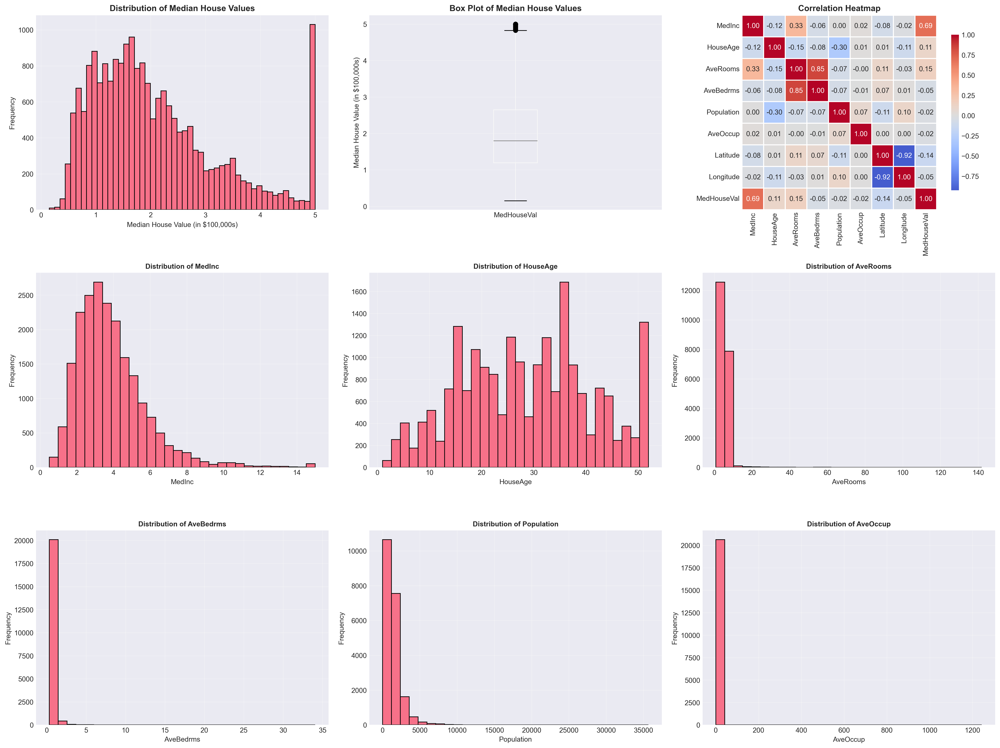
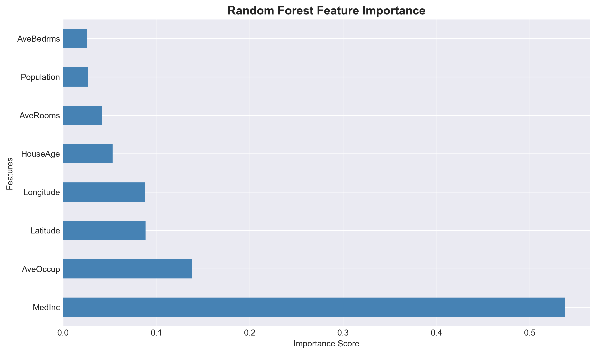
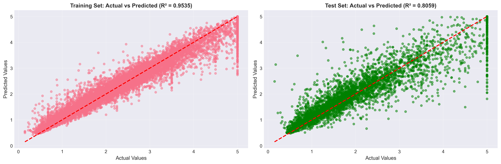

# 🏠 California Housing Price Prediction & EDA

Bu proje, California konut veri setini kullanarak ev fiyatlarını etkileyen faktörleri analiz eder ve **Random Forest Regressor** modeli ile fiyat tahmini yapar.

## 📊 Proje Çıktıları
Proje kapsamında oluşturulan temel görsel analizler aşağıdadır:

### 1. Veri Dağılımı ve Analiz (EDA)

### 2. Özellik Önem Sıralaması (Feature Importance)
Modelimize göre ev fiyatlarını en çok etkileyen faktörler:

### 3. Model Tahmin Başarısı

## 🛠️ Kullanılan Teknolojiler
* **Python** (Pandas, NumPy)
* **Scikit-Learn** (Random Forest Modeling)
* **Matplotlib & Seaborn** (Veri Görselleştirme)

## 🚀 Nasıl Çalıştırılır?
1. Gerekli kütüphaneleri yükleyin: `pip install -r requirements.txt`
2. Analizi başlatın: `python california_housing_prediction.py`
